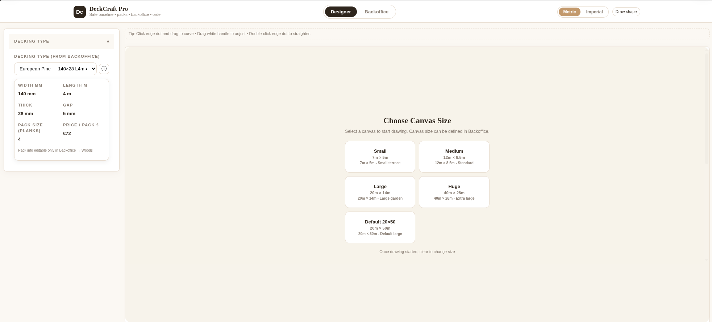

# DeckCraft Pro v1.0.0

Design your deck, see exactly what you need, and order it — all in one file that works offline.

DeckCraft Pro is a tool for anyone who builds or sells wooden decks. You draw the shape, pick your wood and fixings, and it tells you how many packs you need, how much you'll waste, and how to reuse offcuts. No accounts, no cloud, no subscriptions.

Just open [DeckCraft-Pro.html](DeckCraft-Pro.html) in your browser and start.

---

## What it does

**Draw your deck**
- Click to draw any shape — rectangle, L-shape, or freeform around the house
- Zoom, pan, ruler, grid snap
- Works in Metric or Imperial

**Choose how it’s built**
- Decking type, board width/length, gap, thickness
- Joist spacing, fixation (hidden clips, screws, etc.)
- Laying pattern: aligned, staggered 25%/50%/75%, or custom

**Know exactly what to buy**
- Calculates total area, required board positions, stock boards needed
- Waste % and final waste
- Smart offcut reuse: it matches leftovers to new cuts (best-fit) and shows you what’s still reusable
- Packs, price per pack, total order

**Manage your products**
Backoffice lets you:
- Add your wood packs (supplier, sizes, price, stock)
- Manage companies, wood types, fixings
- Generate a branded PDF order for the client

## Make it yours

This is your tool — make it look like your brand.

- 30 themes built-in: warm Oak (default), cold Nord, dark Tokyo Night, Dracula, Olive Grove, Sakura pink, etc.
- Every color can be changed: background, cards, buttons, canvas, headers, pills, grid lines, Metric/Imperial buttons, Designer/Backoffice tabs
- Go to Backoffice → System → Colors, pick a color, it changes live
- No hardcoded beige left — if you see a div that kept its old color, it’s now themeable

Your default is DeckCraft Oak. If you clear storage, it comes back to Oak.

## How to use

1. Download [DeckCraft-Pro.html](DeckCraft-Pro.html)
2. Double-click to open in Chrome / Firefox / Edge
3. Draw your deck on the canvas
4. Set board size and pattern on the left
5. See results on the right: boards needed, offcuts reused, waste
6. Go to Backoffice → Woods/Packs to set your prices
7. Generate PDF order

Want to host it? Just put the single HTML file on any static server.

## Themes

You don’t need to code. In Backoffice → System → Themes & CSS:

- Click Apply on any theme card (you see a mini preview of its colors)
- Or go to Colors and change any of the 20 items:
  - Header Bg = the “DECKING TYPE” accordion header
  - Canvas Bg = the big drawing area and the “Add Wood Pack” form
  - Chip Bg = the little pills like “140 mm” and the offcut cards
  - Tab Active Bg = Designer/Backoffice active button
  - Metric/Imperial Active = Metric/Imperial active button

Export your colors as JSON or as `themes.css` if you want to ship a custom branded version.

## Why a single HTML file?

- Works offline on site, no internet needed
- No install, no database, no backend to maintain
- You can email it, put it on a USB stick, or host it anywhere
- Your data stays in your browser (localStorage)

## What’s in v1.0.0

This is the stable release that fixes all the theme issues we had:

- All divs now follow the theme — no more beige sections that kept old colors
- Metric/Imperial and Designer/Backoffice buttons now themeable
- Colors tab aligned, no empty white or black inputs
- 30 themes (light + dark) back, all working
- Defaults to DeckCraft Oak if no theme saved
- Live CSS Preview removed — theme is live when you Apply anyway
- No more script errors on load

## For your GitHub

- Put `DeckCraft-Pro.html` and this README in the repo
- That’s it. Users download the HTML and open it.

---

Built for deck builders who want a quick, visual, honest calculation — not a complicated CAD.

File: `DeckCraft-Pro_v1.0.0.html` (~423KB)
License: Private - All rights reserved
